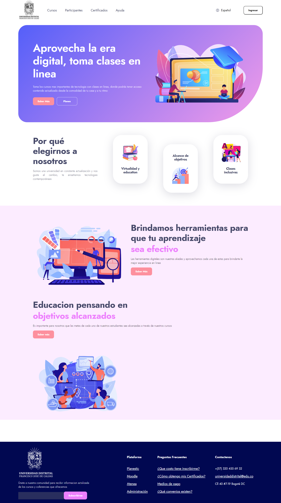

<h1>Taller 9 Andres Felipe Casas Quintero</h1>

<h2> Información</h2>

Curso: full Stack Basico - Grupo 1

Profesor: Cristian Patiño

<h2> Punto 1: Link figma</h2>

<a href="https://www.figma.com/file/26GXxTBE2tB52EUSWYYgej/Andres-Casas---Proyecto-FIGMA?type=design&node-id=0%3A1&mode=design&t=EVyBoheGpHTpI5gY-1" target="_blank">Link de Figma</a>

<h2> Punto 2 : HTML</h2>

<h2> Punto 3 : CSS </h2>

<h2> Punto 4 : Titulos </h2>

<h2> Punto 5 : Estilos de texto </h2>
